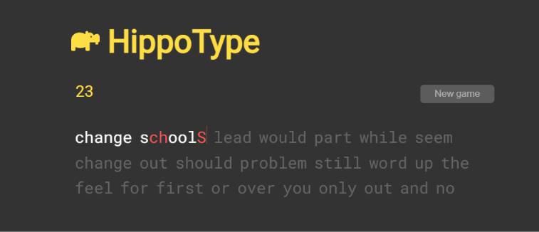

# HippoType

HippoType is a typing speed game built with plain HTML, CSS and JavaScript. Words appear on the screen and you type them as fast and accurately as you can. Correct letters turn green, wrong ones turn red, and the game keeps moving you forward through the word list as you go.

When you finish, the game shows your WPM (words per minute) so you can see how fast you really type and try to beat your own score. It also has a 30 second timer, so every round feels like a quick challenge. Just open the `index.html` file in a browser and start typing, no installation or setup needed.

#AnyOne can Try it here:

https://davidx-004.github.io/HippoTypingGame/
